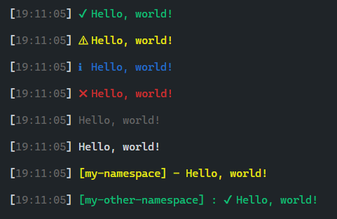

# log-essentials

A simple logger, that combines timestamps, namespaces, colors, logging levels and icons into only simple package!
Uses [colors](https://www.npmjs.com/package/colors), [fancy-log](https://www.npmjs.com/package/fancy-log) and [log-symbols](https://www.npmjs.com/package/log-symbols).



## Usage

Basic usage:

```js
const logger = require('log-essentials')();

logger.setLogLevel('info');
logger.setLogLevel('warn');
logger.setLogLevel('none');
logger.setLogLevel('all');

logger.setIconsEnabled(true);

logger.success('Hello, world!');
logger.warn('Hello, world!');
logger.info('Hello, world!');
logger.error('Hello, world!');
logger.muted('Hello, world!');
logger.log('Hello, world!');
```

With namespace:

```js
const namespacedLogger = require('log-essentials')('my-namespace');
namespacedLogger.warn('Hello, world!');
```

With namespace and custom configuration:

```js
const { getLogger } = require('log-essentials');
const otherNamespacedLogger = getLogger({
  prefix: 'my-logger',
  icons: true,
  seperator: ':',
});
otherNamespacedLogger.success('Hello, world!');
```

## Task List:

- [x] Log levels (all/none/warn/info)
- [x] Icons
- [x] Namespaces
- [ ] Fancy(er) namespace badges
- [ ] More optional styling options (backround color, underlined, etc.)
- [ ] Log time between log messages
