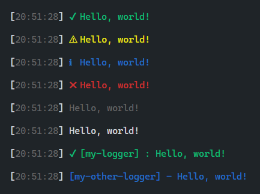

# log-essentials

Log things, prefixed with a timestamp and name. Also uses colors and logging levels!



## Usage

Basic usage:

```js
const logger = require('log-essentials')();

logger.setLogLevel('info');
logger.setLogLevel('warn');
logger.setLogLevel('none');
logger.setLogLevel('all');

logger.setIconsEnabled(true);

logger.success('Hello, world!');
logger.warn('Hello, world!');
logger.info('Hello, world!');
logger.error('Hello, world!');
logger.muted('Hello, world!');
logger.log('Hello, world!');
```

With namespace:

```js
const namespacedLogger = require('log-essentials')('my-namespace');
namespacedLogger.warn('Hello, world!');
```

With namespace and custom configuration:

```js
const { getLogger } = require('log-essentials');
const otherNamespacedLogger = getLogger({
  prefix: 'my-logger',
  icons: true,
  seperator: ':',
});
otherNamespacedLogger.success('Hello, world!');
```
